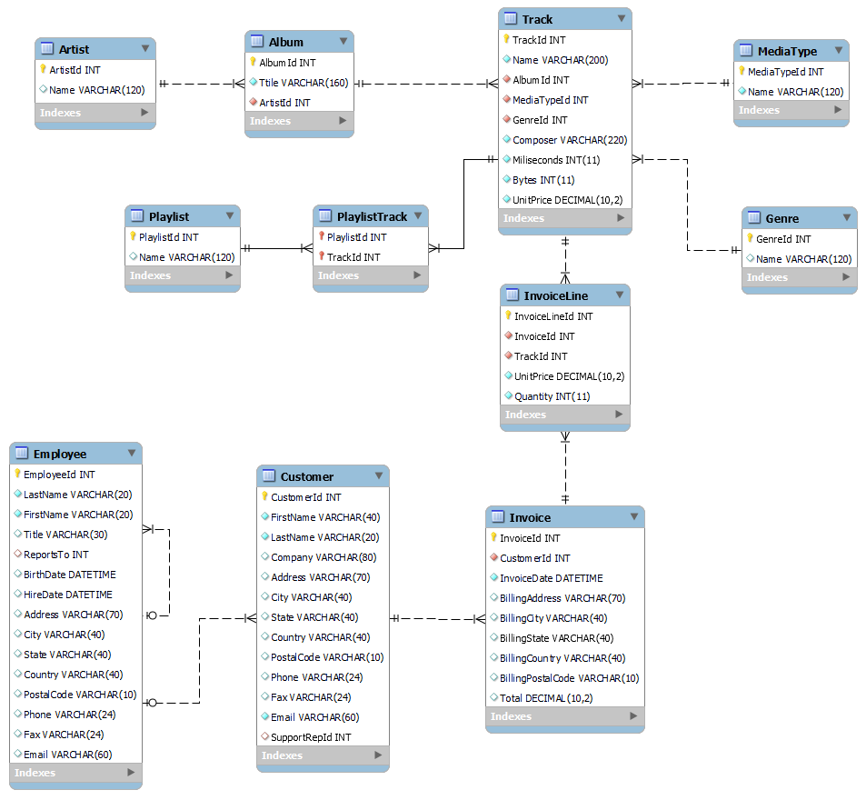
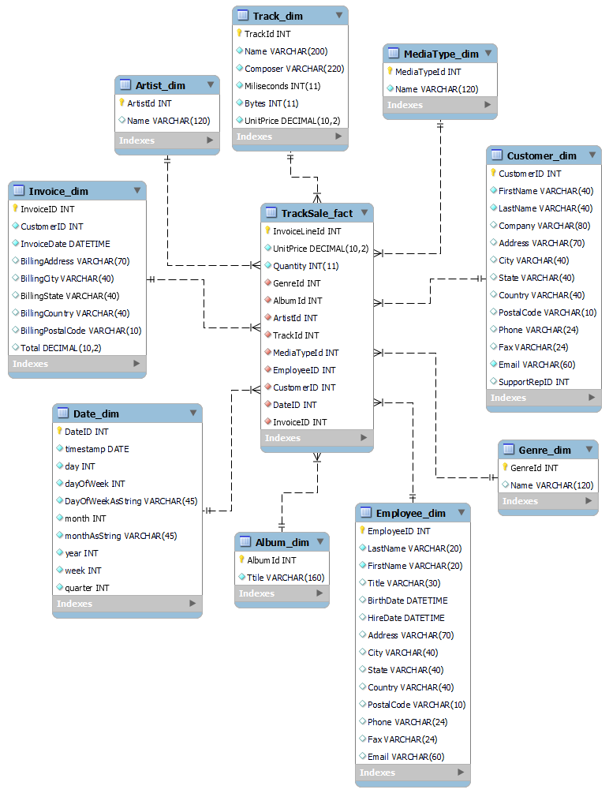
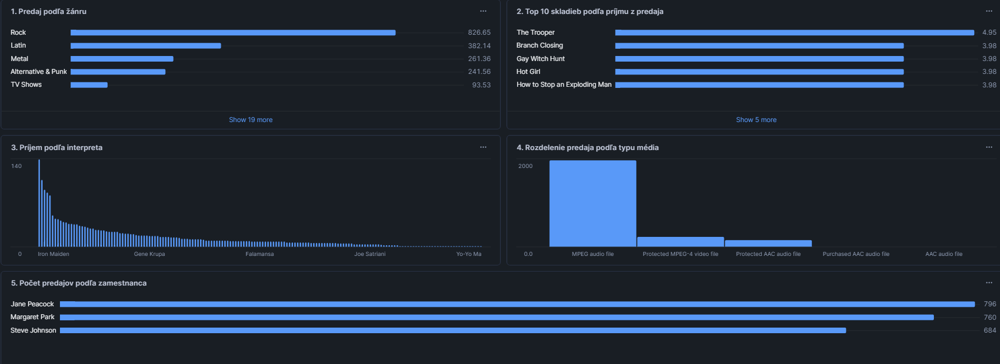


# Dokumentácia ETL procesu pre dataset Chinook

## 1. Úvod a popis zdrojových dát

Cieľom tohto projektu je analyzovať dáta z datasetu Chinook, zameriavajúceho sa na predaj hudby, interpretov, žánrov a transakcií so zákazníkmi. Projekt mieri na identifikáciu predajných trendov a správania používateľov prostredníctvom ETL procesu implementovaného v nástroji Snowflake.

Zdrojové dáta obsahujú tieto tabuľky:

- **Artist**: Obsahuje informácie o interpretoch, vrátane ich jedinečného ID a mena.
- **Album**: Obsahuje informácie o albumoch, vrátane ich ID, názvov a prepojenia na interpreta.
- **Track**: Obsahuje informácie o skladbách, vrátane ich ID, mena, albumu, interpreta, mediálneho typu, žánru, ceny, dĺžky a počtu bajtov.
- **InvoiceLine** a **Invoice**: Obsahujú detaily jednotlivých predajov, faktúr, cien a počtu zakúpených jednotiek.
- **Customer** a **Employee**: Obsahujú informácie o zákazníkoch a zamestnancoch, vrátane ich kontaktných údajov.
- **Genre** a **MediaType**: Obsahujú kategorizácie skladieb podľa žánrov a typov médií.
- **Playlist** a **PlaylistTrack**: Informácie o playlistoch a ich skladbách.

ERD diagram znázorňujúci vzťahy medzi tabuľkami:



## 2. Návrh dimenzionálneho modelu

Navrhli sme multi-dimenzionálny model typu hviezda s nasledujúcimi tabuľkami:

### Faktová tabuľka
**TrackSale_fact**:
- **Kľúče**: InvoiceLineId, TrackId, AlbumId, ArtistId, GenreId, MediaTypeId
- **Metirky**: UnitPrice, Quantity, TotalRevenue
- **Použitie**: Meranie celkového príjmu z predaja, analýza počtu predaných jednotiek.

### Dimenzionálne tabuľky

1. **Track_dim**
   - **Údaje**: TrackId, Name, Composer, Milliseconds, Bytes, UnitPrice
   - **Typ dimenzie**: SCD Type 1

2. **Artist_dim**
   - **Údaje**: ArtistId, Name
   - **Typ dimenzie**: SCD Type 1

3. **Album_dim**
   - **Údaje**: AlbumId, Title
   - **Typ dimenzie**: SCD Type 1

4. **MediaType_dim**
   - **Údaje**: MediaTypeId, Name
   - **Typ dimenzie**: SCD Type 1

5. **Genre_dim**
   - **Údaje**: GenreId, Name
   - **Typ dimenzie**: SCD Type 1

6. **Customer_dim**
   - **Údaje**: CustomerId, FirstName, LastName, Address, City, State, Country, PostalCode, Phone, Email, SupportRepId
   - **Typ dimenzie**: SCD Type 1

7. **Employee_dim**
   - **Údaje**: EmployeeId, LastName, FirstName, Title, BirthDate, HireDate, Address, City, State, Country, PostalCode, Phone, Fax, Email
   - **Typ dimenzie**: SCD Type 1

8. **Date_dim**
   - **Údaje**: timestamp, day, dayOfWeek, DayOfWeekAsString, month, monthAsString, year, week, quarter
   - **Typ dimenzie**: SCD Type 1

9. **Invoice_dim**
   - **Údaje**: InvoiceId, CustomerId, InvoiceDate, BillingAddress, BillingCity, BillingState, BillingCountry, BillingPostalCode, Total
   - **Typ dimenzie**: SCD Type 1





  

# ETL proces v Snowflake

  

ETL proces v Snowflake sa skladá z troch hlavných fáz: **extrakcia dát** (Extract), **transformácia dát** (Transform), a **načítanie dát** (Load). Tento proces bol implementovaný na spracovanie a analýzu údajov zo zdrojového datasetu, pričom výsledný model bol pripravený na analytické operácie.

  

## 3.1 Extract (Extrahovanie dát)

  

Dáta boli zo zdrojového datasetu vo formáte CSV nahrané do Snowflake pomocou interného stage úložiska s názvom `skunk_stage`. Stage slúži ako dočasné úložisko, ktoré umožňuje efektívne spracovanie a import dát.

  

Vytvorenie stage v Snowflake:

```sql
CREATE  OR  REPLACE STAGE skunk_stage;
```

  

Dáta boli nahrané do staging tabuliek pomocou príkazu `COPY INTO`:

```sql
COPY  INTO Artist
FROM  @skunk_stage/artist.csv
FILE_FORMAT  = (TYPE  =  'CSV' FIELD_OPTIONALLY_ENCLOSED_BY =  '"' SKIP_HEADER =  1);

```

  

Tento príkaz sa opakoval pre každú tabuľku (Artist, Album, Customer, Employee, atď.). Ak sa vyskytli nekonzistentné dáta, proces pokračoval aj pri chybách pomocou parametra `ON_ERROR = 'CONTINUE'`.

  

## 3.2 Transform (Transformácia dát)

  

V tejto fáze boli dáta z staging tabuliek spracované na vytvorenie dimenzií a faktovej tabuľky, ktoré sú optimalizované na analytické operácie.

  

### Vytvorenie faktovej tabuľky `TrackSale_fact`:

Faktová tabuľka obsahuje informácie o predaji skladieb, ako sú jednotkové ceny, množstvo a celkové príjmy. Spojením tabuliek `InvoiceLine`, `Track`, `Album`, `Invoice`, `Customer`,`Artist`,`Date`,`Employee`,`Genre`, `MediaType` sme získali všetky potrebné informácie:

```sql
CREATE TABLE TrackSale_fact AS
SELECT
    il.InvoiceLineId AS InvoiceLineId, 
    il.InvoiceId AS InvoiceID,
    il.UnitPrice AS UnitPrice,
    il.Quantity AS Quantity,
    (il.UnitPrice * il.Quantity) AS TotalRevenue,
    t.GenreId AS GenreId,
    t.AlbumId AS AlbumId,
    t.MediaTypeId AS MediaTypeId,
    t.TrackId AS TrackId,
    al.ArtistId AS ArtistId,
    i.CustomerId AS CustomerID,
    i.InvoiceDate AS InvoiceDate,
    c.SupportRepId AS EmployeeID
FROM
    InvoiceLine AS il
JOIN
    Track AS t ON il.TrackId = t.TrackId
JOIN
    Album AS al ON t.AlbumId = al.AlbumId
JOIN
    Invoice AS i ON il.InvoiceId = i.InvoiceId
JOIN
    Customer AS c ON i.CustomerId = c.CustomerId;
```

  

### Vytvorenie dimenzií:

  

1.  **Track_dim:** Táto dimenzia obsahuje informácie o jednotlivých skladbách, ako sú názov, skladateľ, dĺžka a cena.

```sql
CREATE TABLE  Track_dim  AS
SELECT
    TrackId AS TrackId,
    Name  AS TrackName,
    Composer AS Composer,
    Milliseconds AS Milliseconds,
    Bytes AS Bytes,
    UnitPrice AS UnitPrice
FROM
    Track;
```

  

2.  **Artist_dim:** Dimenzia pre umelcov obsahuje informácie o názve interpreta.

```sql
CREATE  TABLE  Artist_dim  AS
SELECT
    ArtistId AS ArtistId,
    Name  AS ArtistName
FROM
    Artist;
```

  

3.  **Album_dim:** Dimenzia pre albumy, ktorá uchováva názvy albumov.

```sql
CREATE  TABLE  Album_dim  AS
SELECT
    AlbumId AS AlbumId,
    Title AS AlbumTitle
FROM
    Album;

```

  

4.  **MediaType_dim:** Dimenzia pre typy médií, ktorá obsahuje názvy mediálnych formátov.

```sql
CREATE  TABLE  MediaType_dim  AS
SELECT
    MediaTypeId AS MediaTypeId,
    Name  AS MediaTypeName
FROM
    MediaType;
```

  

5.  **Genre_dim:** Dimenzia pre žánre, ktorá obsahuje názvy žánrov.

```sql
CREATE  TABLE  Genre_dim  AS
SELECT
    GenreId AS GenreId,
    Name  AS GenreName
FROM
    Genre;
```

6.  **Customer_dim:** Dimenzia pre zákazníkov, ktorá obsahuje údaje o zákazníkoch.

```sql
CREATE  TABLE Customer_dim AS
SELECT
    CustomerId AS CustomerID,
    FirstName AS FirstName,
    LastName AS LastName,
    Address  AS  Address,
    City AS City,
    State  AS  State,
    Country AS Country,
    PostalCode AS PostalCode,
    Phone AS Phone,
    Email AS Email,
    SupportRepId AS SupportRepID
FROM
    Customer;
```

7.  **Employee_dim:** Dimenzia pre zamestnancov, ktorá obsahuje údaje o zamestnancoch.

```sql
CREATE TABLE Employee_dim AS
SELECT
    EmployeeId AS EmployeeID,
    LastName AS LastName,
    FirstName AS FirstName,
    Title AS Title,
    BirthDate AS BirthDate,
    HireDate AS HireDate,
    Address  AS  Address,
    City AS City,
    State  AS  State,
    Country AS Country,
    PostalCode AS PostalCode,
    Phone AS Phone,
    Fax AS Fax,
    Email AS Email
FROM
    Employee;
```
8.  **Date_dim:** Dimenzia pre dátum, ktorá obsahuje údaje o dátume.

```sql
CREATE TABLE Date_dim AS
SELECT
    DISTINCT
    InvoiceDate AS  timestamp,
    DAY(InvoiceDate) AS  day,
    TO_CHAR(InvoiceDate, 'D') AS  dayOfWeek,
    TO_CHAR(InvoiceDate, 'Day') AS DayOfWeekAsString, 
    MONTH(InvoiceDate) AS  month,
    TO_CHAR(InvoiceDate, 'Month') AS monthAsString, 
    YEAR(InvoiceDate) AS  year,
    WEEK(InvoiceDate) AS  week,
    QUARTER(InvoiceDate) AS  quarter
FROM
    Invoice;
```

9.  **Invoice_dim:** Dimenzia pre Invoice, ktorá obsahuje údaje o objednávke.

```sql
CREATE TABLE Invoice_dim AS
SELECT
    InvoiceId AS InvoiceID,
    CustomerId AS CustomerID,
    InvoiceDate AS InvoiceDate,
    BillingAddress AS BillingAddress,
    BillingCity AS BillingCity,
    BillingState AS BillingState,
    BillingCountry AS BillingCountry,
    BillingPostalCode AS BillingPostalCode,
    Total AS Total
FROM
    Invoice;
```
  

## 3.3 Load (Načítanie dát)

  

Po úspešnej transformácii dát do požadovaných formátov boli všetky dimenzie a faktová tabuľka nahraté do finálnej štruktúry. Nakoniec boli staging tabuľky odstránené, aby sa optimalizovalo využitie úložiska:

```sql
DROP  TABLE  IF  EXISTS Artist;
DROP  TABLE  IF  EXISTS Album;
DROP  TABLE  IF  EXISTS Genre;
DROP  TABLE  IF  EXISTS MediaType;
DROP  TABLE  IF  EXISTS Track;
DROP  TABLE  IF  EXISTS Playlist;
DROP  TABLE  IF  EXISTS PlaylistTrack;
DROP  TABLE  IF  EXISTS InvoiceLine;
DROP  TABLE  IF  EXISTS Invoice;
DROP  TABLE  IF  EXISTS Customer;
DROP  TABLE  IF  EXISTS Employee;
```

  

---

  

ETL proces umožnil spracovanie pôvodných dát z CSV formátu do viacdimenzionálneho modelu typu hviezda, ktorý je optimalizovaný na analytické operácie a vizualizácie. Tento model poskytuje robustnú základňu na analýzu a vizualizáciu používateľského správania a hudobných preferencií.

## 4. Vizualizácia dát



1. **Predaj podľa žánru**
   - Vizualizácia: Stĺpcový graf zobrazujúci celkový príjem (TotalRevenue) podľa žánru.
   - SQL dotaz:
     ```sql
     SELECT 
       g.GenreName, 
       SUM(ts.TotalRevenue) AS TotalRevenue
     FROM 
       TrackSale_fact ts
     JOIN 
       Genre_dim g ON ts.GenreId = g.GenreId
     GROUP BY 
       g.GenreName
     ORDER BY 
       TotalRevenue DESC;
     ```

2. **Top 10 skladieb podľa príjmu**
   - Vizualizácia: Stĺpcový graf zobrazujúci 10 najlepších skladieb podľa príjmu.
   - SQL dotaz:
     ```sql
     SELECT 
         t.TrackName, 
         SUM(ts.TotalRevenue) AS TotalRevenue
     FROM 
         TrackSale_fact ts
     JOIN 
         Track_dim t ON ts.TrackId = t.TrackId
     GROUP BY 
         t.TrackName
     ORDER BY 
         TotalRevenue DESC
     LIMIT 10;

     ```

3. **Predaj podľa interpreta**
   - Vizualizácia: Stĺpcový graf zobrazujúci celkový príjem (TotalRevenue) podľa interpreta.
   - SQL dotaz:
     ```sql
     SELECT 
        a.ArtistName, 
        SUM(ts.TotalRevenue) AS TotalRevenue
     FROM 
        TrackSale_fact ts
     JOIN 
        Artist_dim a ON ts.ArtistId = a.ArtistId
     GROUP BY 
        a.ArtistName
     ORDER BY 
        TotalRevenue DESC;
     ```

4. **Predaj podľa média**
   - Vizualizácia: Stĺpcový graf zobrazujúci celkový príjem (TotalRevenue) podľa typu média.
   - SQL dotaz:
     ```sql
     SELECT 
         mt.MediaTypeName, 
         SUM(ts.TotalRevenue) AS TotalRevenue
     FROM 
         TrackSale_fact ts
     JOIN 
         MediaType_dim mt ON ts.MediaTypeId = mt.MediaTypeId
     GROUP BY 
         mt.MediaTypeName
     ORDER BY 
         TotalRevenue DESC;
     ```

5. **Predaj podľa zamestnanca**
   - Vizualizácia: Stĺpcový graf zobrazujúci počet predajov (NumberOfSales) vykonaných zamestnancami.
   - SQL dotaz:
     ```sql
     SELECT 
         e.EmployeeId, 
         e.FirstName || ' ' || e.LastName AS EmployeeName, 
         COUNT(ts.InvoiceLineId) AS NumberOfSales
     FROM 
         TrackSale_fact ts
     JOIN 
         Customer_dim c ON ts.CustomerID = c.CustomerID
     JOIN 
         Employee_dim e ON c.SupportRepId = e.EmployeeID
     GROUP BY 
         e.EmployeeId, e.FirstName, e.LastName
     ORDER BY 
         NumberOfSales DESC;
     ```

Každá vizualizácia poskytuje hodnotné ľahko interpretovateľné pohľady na dáta a pomáha odpovedať na dôležité obchodné otázky.

Autor: Kristián Szabó

